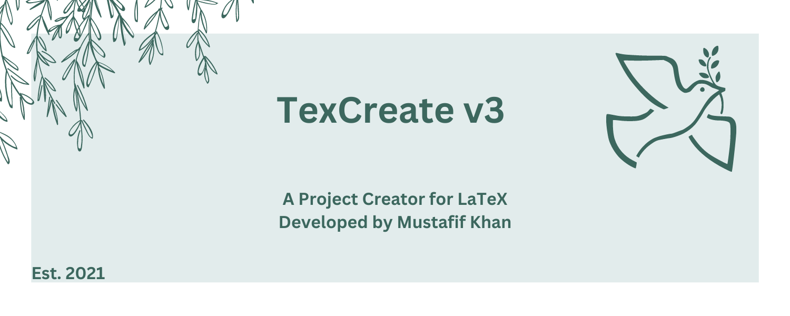
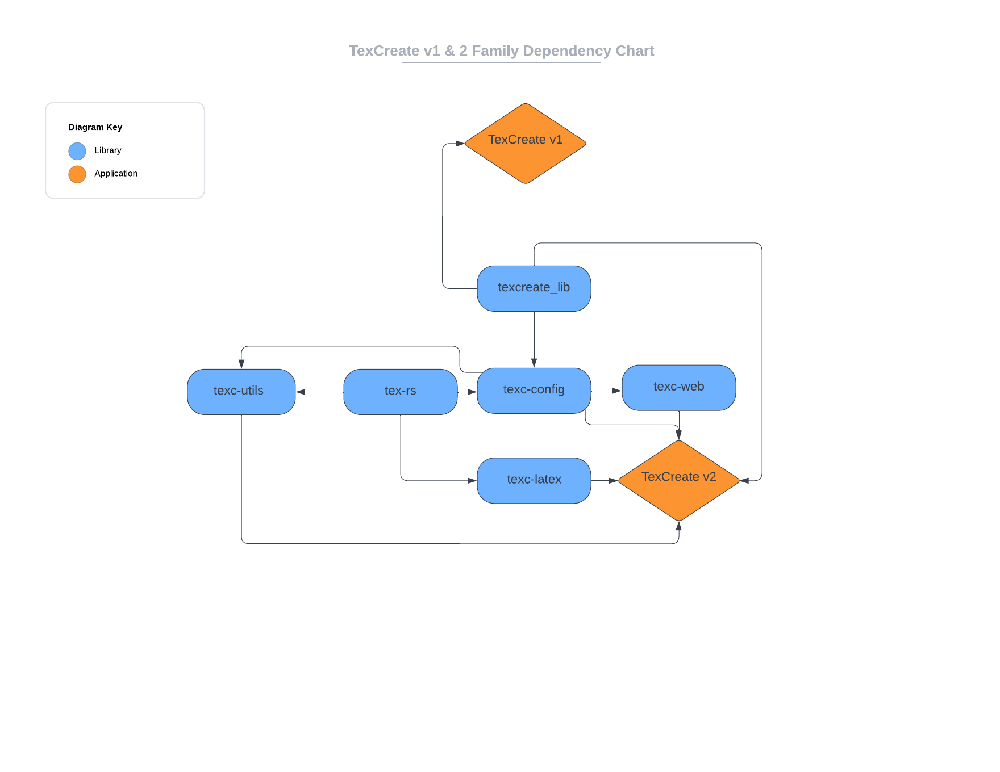
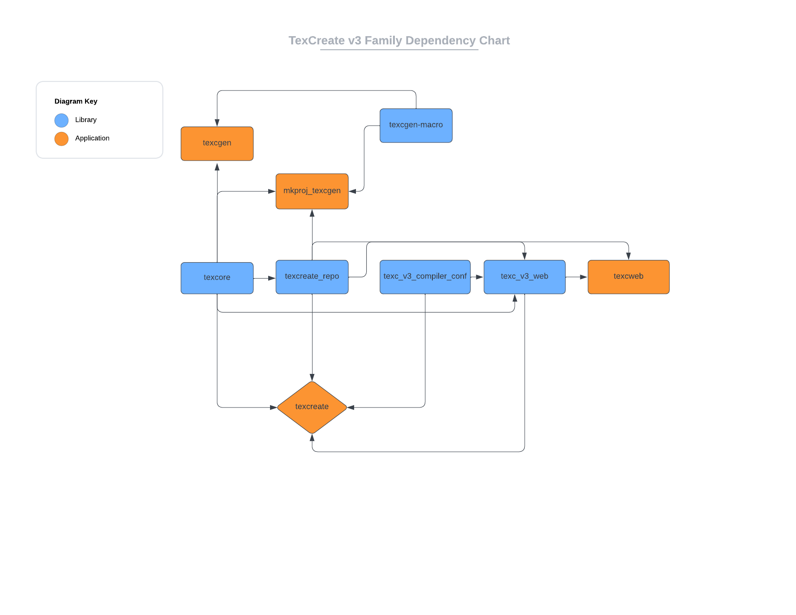

# What is TexCreate?

TexCreate is a LaTeX project creator developed by myself, Mustafif Khan since 2021 and is actively being maintained as my main portfolio project. The project started from my laziness; I found setting up LaTeX documents annoying whenever I had something new to do (I use LaTeX over word processors). I created a program to write a document for me using some prebuilt templates embedded in the program. When I wrote TexCreate, I found it very useful, and it saved me a lot of time, such as when I used it for a Physics tutorial with the Lachaise template.

TexCreate version 3 focuses on template modularity which in simple terms means that instead of the prebuilt templates 
being hardcoded into the program, they are instead managed by releases with a web service. Every new major version 
expands on the core idea of TexCreate as a LaTeX project creator that helps ease development, and with every new version 
the codebase increasingly becomes a lot more complex. 

To get a good idea of how much the project has grown, consider the following dependency flow charts which show TexCreate 
and related libraries/applications that work with it. 

> To look at all related repositories for TexCreate v3, take a look at the [texc_v3_sources](https://github.com/MKProj/texc_v3_sources) repo. 
